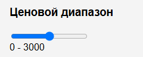
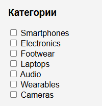
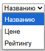
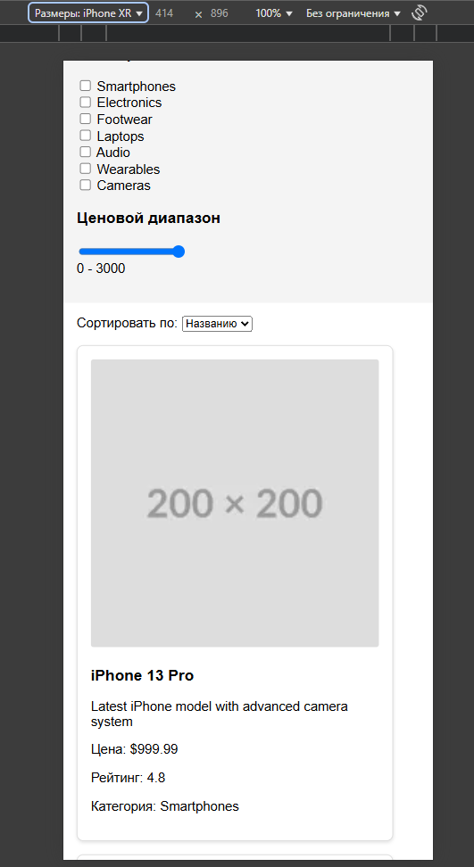

# Test.Tranio 
## Установка
1. Клонируйте репозиторий на свой локальный компьютер.
2. Убедитесь, что файл `cards.json` находится в папке `data`.
3. Откройте файл `index.html` в вашем веб-браузере.
## Использование
- фильтр по цене
- 
- фильтры в боковой панели для фильтрации товаров по категориям и ценовому диапазону.
- 
- выпадающий список для сортировки товаров по названию, цене или рейтингу.
- 
- иконки меняются с соотношением экрана
- 